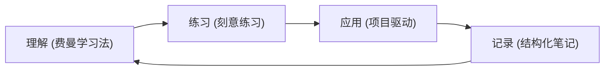

# Learning Methodology: 如何高效地学习复杂技术

学习并熟悉 C++ 和 Go 的精髓，以及构建大型后端系统的能力，是一个系统工程。我采用一套结合了经典理论和实践经验的学习方法，力求高效且深入。

## 1. 费曼学习法 (Feynman Technique) - 以教促学

核心思想：**如果你不能简单地解释它，说明你还没有真正理解它。**

**实践方式：**
*   **学习后立即复述：** 在阅读完一个复杂概念（如 Go 的逃逸分析、C++ 的移动语义）后，立刻尝试用自己的话，像给一个初学者讲解一样，口头或书面复述其核心要点。
*   **撰写笔记：** `cpp-go-odyssey` 仓库本身就是费曼学习法的产物。撰写 `My_Journey.md`、`Tech_Stack_Focus.md` 或 `GMP_Architecture.md` 等文档的过程，就是强制自己梳理逻辑、填补知识漏洞的过程。
*   **识别盲点：** 在复述或写作时遇到卡壳的地方，就是我的知识盲点。这会指引我回到源头（书籍、文档、源码）进行更深入的研究。

## 2. 刻意练习 (Deliberate Practice) - 跳出舒适区

核心思想：**有目的、有反馈、专注地练习，而非重复性劳动。**

**实践方式：**
*   **明确目标：** 每次学习都设定一个具体、可衡量的目标。例如：“今天的目标是理解 `std::async` 的 `std::launch::deferred` 和 `std::launch::async` 的区别，并写代码验证。”
*   **挑战性任务：** 主动寻找超出当前能力的任务。例如，不满足于使用 `pprof`，而是尝试分析一个模拟的高延迟场景，定位到具体的 Goroutine 阻塞点。
*   **即时反馈：** 通过运行代码、查看测试结果、性能剖析工具（`perf`, `pprof`）来获得即时反馈。GitHub Issues 也可以作为外部反馈渠道。
*   **专注与迭代：** 一次只专注于一个技能点，反复练习，根据反馈调整，直到掌握。

## 3. 项目驱动学习 (Project-Based Learning) - 实践出真知

核心思想：**将知识应用于构建真实（或模拟真实）的项目中，是巩固和深化理解的最佳途径。**

**实践方式：**
*   **微型项目：** 在 `05_Hands_On_Projects` 目录下，实现小型但完整的系统，如一个简易的 HTTP 服务器、一个支持基本操作的键值存储（TinyKV）、一个并发安全的队列。这迫使你整合多个知识点。
*   **解决“痛点”：** 模拟工作中可能遇到的性能问题或设计难题，并尝试用所学知识解决。例如：“如何设计一个缓存系统来应对缓存雪崩？”
*   **代码即证明：** 动手写出来的代码，是对学习成果最直接的证明。

## 4. 结构化笔记 (Structured Note-Taking)

*   **按主题组织：** 使用清晰的目录结构（如本仓库所示），将知识分门别类。
*   **图文并茂：** 对于复杂机制（如 G-P-M 调度），使用流程图或示意图辅助理解。
*   **链接关联：** 在笔记中使用 Markdown 链接，将相关概念（如 `Concurrency` -> `Mutex` -> `Atomic Operations`）关联起来，形成知识网络。

## 5. 学习闭环：理解 -> 练习 -> 应用 -> 记录

我的学习方法是一个持续迭代的闭环：

