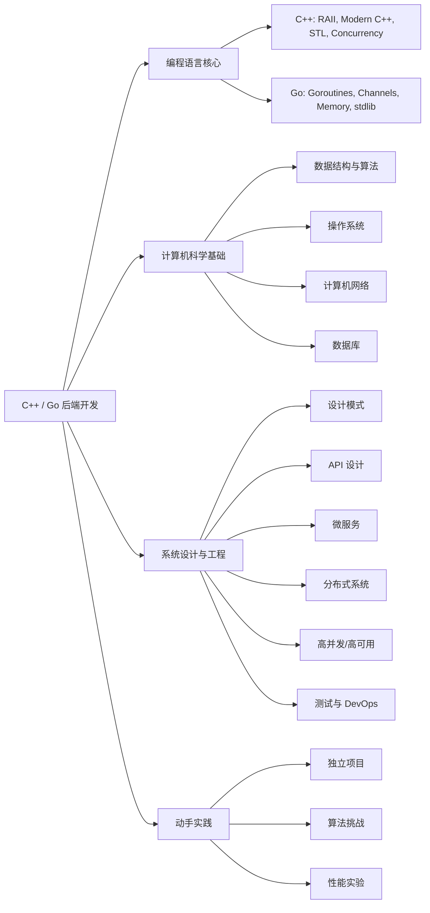

# Tech Stack Focus: C++ 与 Go 后端开发核心领域

本仓库聚焦于 C++ 和 Go 在现代后端开发中的核心技术栈。目标是构建一个全面且深入的知识体系。

## 🎯 核心技术栈概略图

```mermaid
graph LR
    A[C++ / Go 后端开发] --> B[编程语言核心]
    A --> C[计算机科学基础]
    A --> D[系统设计与工程]
    A --> E[动手实践]

    B --> B1[C++: RAII, Modern C++, STL, Concurrency]
    B --> B2[Go: Goroutines, Channels, Memory, stdlib]

    C --> C1[数据结构与算法]
    C --> C2[操作系统]
    C --> C3[计算机网络]
    C --> C4[数据库]

    D --> D1[设计模式]
    D --> D2[API 设计]
    D --> D3[微服务]
    D --> D4[分布式系统]
    D --> D5[高并发/高可用]
    D --> D6[测试与 DevOps]

    E --> E1[独立项目]
    E --> E2[算法挑战]
    E --> E3[性能实验]
```
